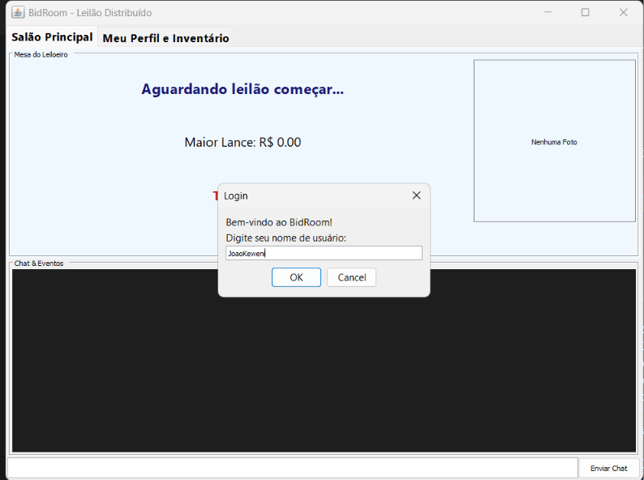
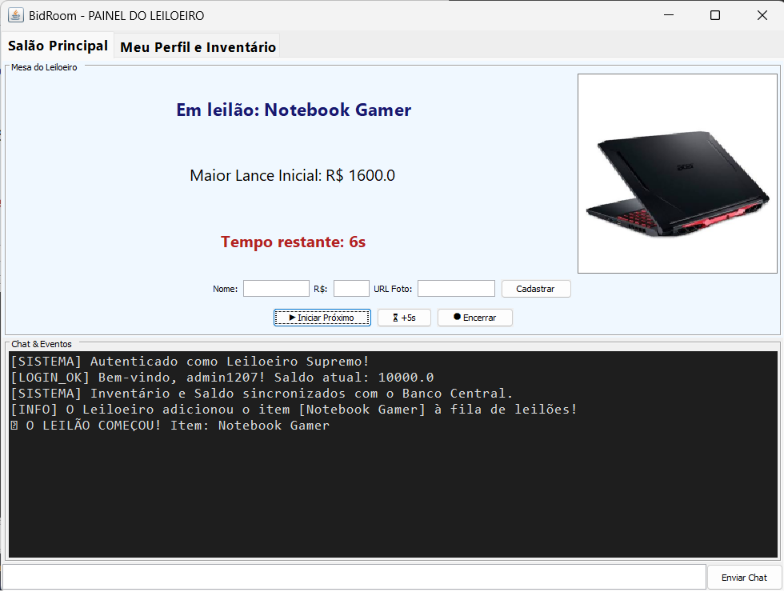
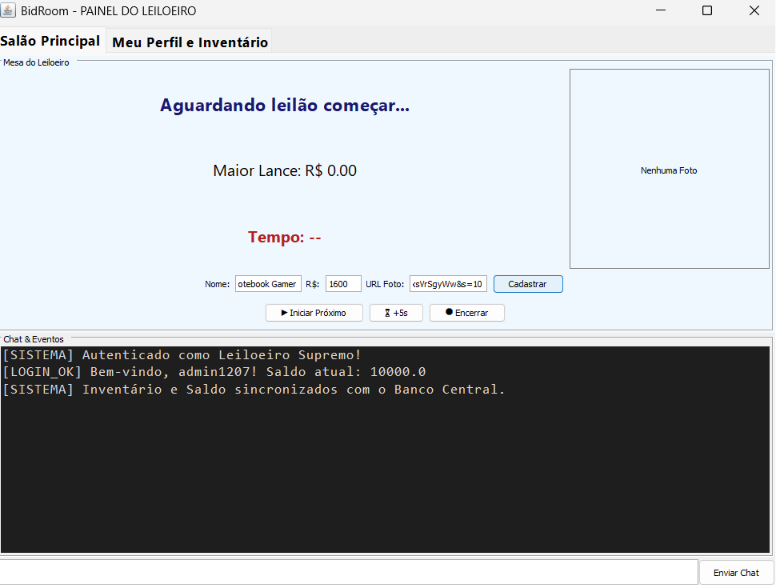
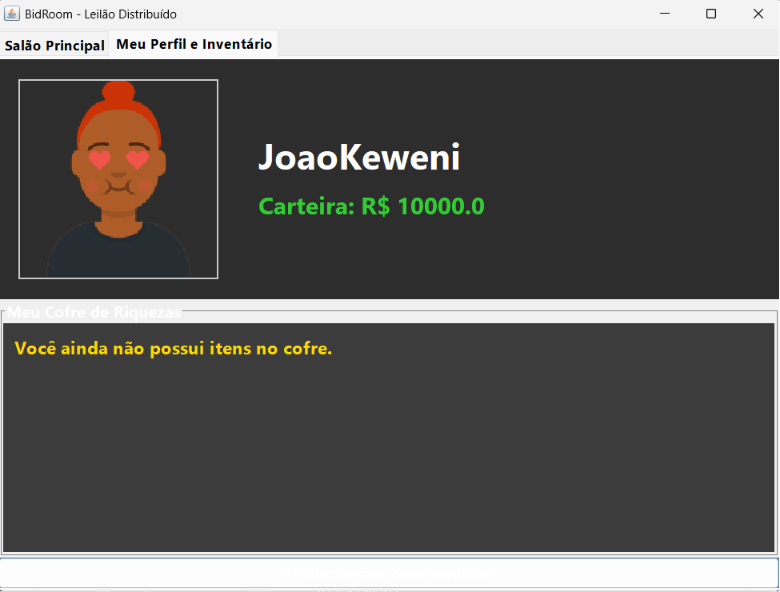

# BidRoom - Leilão Multiplayer em Tempo Real

<p align="center">
  
  
  
  
</p>

O **BidRoom** é uma aplicação distribuída em Java construída puramente com **TCP Sockets**. O sistema simula um ambiente de leilão de alta performance e tempo real, onde múltiplos clientes disputam itens simultaneamente. O projeto foi projetado para demonstrar na prática soluções arquiteturais para Sistemas Distribuídos, como controle de concorrência, consistência de dados e sincronização de estado através da rede.

---

## Demonstração Visual 

<div align="center">
  
  <p><i>Tela de Login: Acesso com geração de Avatar aleatório.</i></p>
</div>

<div align="center">
  
  <p><i>Visão do Comprador: Disputando o leilão em tempo real.</i></p>
</div>

<div align="center">
  
  <p><i>Painel do Leiloeiro (Admin): Controle da mesa, cadastro de itens e gestão de tempo.</i></p>
</div>

<div align="center">
  
  <p><i>Aba de Inventário: Acompanhamento dos itens arrematados e do perfil.</i></p>
</div>

---

## Arquitetura de Comunicação e Sockets

O projeto adota a arquitetura **Cliente-Servidor Estrela**. O Servidor atua como o "Banco Central" e juiz do leilão, enquanto os clientes são "Telas Burras" (*Thin Clients*). 

- **Multi-threading Escalável:** Para garantir que o servidor atenda dezenas de conexões ao mesmo tempo sem bloquear, utilizamos a abordagem de Thread-por-Conexão (`ClientHandler`). A Thread principal do servidor aceita a conexão no `serverSocket.accept()` e imediatamente delega a comunicação daquele cliente para uma Thread operária isolada.
- **Protocolo Customizado (Baseado em Texto):** Não utilizamos objetos Java serializados (`Serializable`). Em vez disso, criamos um protocolo leve baseado em texto puro com o delimitador `|` (ex: `BID|1000`, `TIME|25`, `AUCTION_START|Mona Lisa|...`). Isso traz **interoperabilidade**, permitindo que no futuro clientes em Python, C# ou Flutter se conectem ao nosso servidor TCP.
- **Comunicação Bidirecional Assíncrona:** Enquanto o usuário do Swing (Cliente) envia comandos esporádicos pela `PrintWriter`, uma Thread em *background* fica travada num `BufferedReader.readLine()` escutando ininterruptamente os *broadcasts* do servidor.

---

## Soluções Técnicas para o Leilão (Concorrência e Estado)

Construir um leilão distribuído apresenta desafios severos de estado concorrente. Como o BidRoom resolve os clássicos problemas da engenharia de software:

### 1. Prevenção de *Race Conditions* (Condição de Corrida)
**O Problema:** O que acontece se o João e a Maria clicarem em "Dar Lance" de R$ 5.000 no exato mesmo milissegundo?  
**A Solução:** O servidor valida e processa lances dentro de um método protegido por exclusão mútua usando a palavra reservada `synchronized` em Java. A primeira Thread a chegar bloqueia o monitor; ela debita o valor e atualiza o estado. A segunda Thread aguarda na fila. Quando for liberada para entrar, ela lerá o novo valor atualizado e seu lance atrasado será rejeitado. Garantimos total integridade de dados!

### 2. O Relógio *Single Source of Truth*
**O Problema:** E se um "hacker" modificar o relógio do Windows local ou usar um *Cheat Engine* na memória RAM para fraudar o tempo do leilão?  
**A Solução:** Os clientes Java Swing **não contam o tempo**. O cronômetro roda isolado em uma Thread central no Servidor. A cada 1 segundo (`Thread.sleep(1000)`), o servidor faz o broadcast global do tempo restante. A interface gráfica apenas obedece e desenha o valor recebido na tela.

### 3. Sistema Anti-Sniping e Pagamento Atômico
- **Anti-Sniping:** Se um lance é efetuado quando restam menos de 10 segundos, a Thread do servidor automaticamente reseta o tempo para 10 segundos, permitindo que a sala reaja.
- **Liquidação Atômica:** Quando o tempo zera, o servidor bloqueia novos lances e faz o débito na conta do vencedor direto na memória, transferindo a posse da *String* do item para a lista de inventário do usuário. Tudo isso sem depender da "permissão" do cliente.

### 4. Interface Gráfica Responsiva (EDT Bypass)
**O Problema:** O download de imagens (como a foto de um carro de leilão ou um Avatar na API) "congela" a tela do Java Swing se feito na *Event Dispatch Thread (EDT)*.  
**A Solução:** Ao receber a mensagem `AUCTION_START` contendo uma URL, o front-end abre uma Thread assíncrona para buscar a imagem (`ImageIO.read(url)`). Ao terminar o download sem travar os botões da tela, usamos o `SwingUtilities.invokeLater()` para injetar com segurança os *pixels* no JLabel da interface. A experiência de lances flui lindamente e sem travamentos.

---

## 🚀 Como Executar o Projeto

**Pré-requisitos:**
- JDK 21+ instalado na máquina.
- Todos os computadores na mesma rede local/Wi-Fi (caso rode em múltiplas máquinas).

### Passo 1: Compilação
Abra o terminal na pasta raiz do projeto (`BidRoom/`) e recompile todas as classes para a pasta `bin`:
```bash
javac -d bin src/models/*.java src/server/*.java src/client/*.java
```

### Passo 2: Iniciar o Servidor (O Leiloeiro Central)
O servidor precisa subir primeiro para abrir a porta 5000.
```bash
java -cp bin server.MainServer
```

### Passo 3: Iniciar os Clientes
Abra novos terminais (ou execute de outros computadores) para abrir as telas do jogo.
```bash
java -cp bin client.MainGUIClient
```
- **Para logar como Comprador:** Digite qualquer nome.
- **Para logar como Admin / Leiloeiro:** Digite `admin1207` no login. A interface sofrerá uma mutação e exibirá o painel de controle de leilões!

---

## 📂 Documentação Aprofundada
Se você quiser entender cada linha da engenharia do projeto, confira os artigos auxiliares na pasta `docs/`:
- [`entenda_o_codigo.md`](docs/entenda_o_codigo.md): Explicação profunda sobre a manipulação de concorrência com Sockets e Multi-threading.
- [`design_e_comunicacao.md`](docs/design_e_comunicacao.md): Como funciona o padrão "Tela Burra" do Java Swing e o carregamento assíncrono de Mídia.
- [`perguntas_professor.md`](docs/perguntas_professor.md): Um guia para responder qualquer pergunta que a banca possa fazer sobre vulnerabilidades ou arquitetura de redes.
- [`guia_projeto.md`](docs/guia_projeto.md): Trechos de códigos mais importantes explicados para a apresentação acadêmica.
